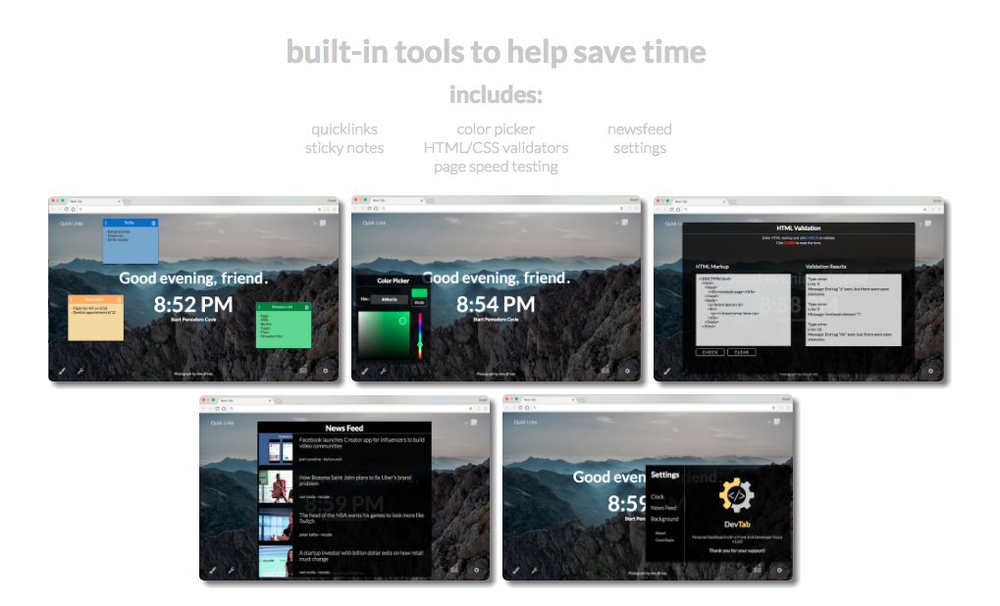
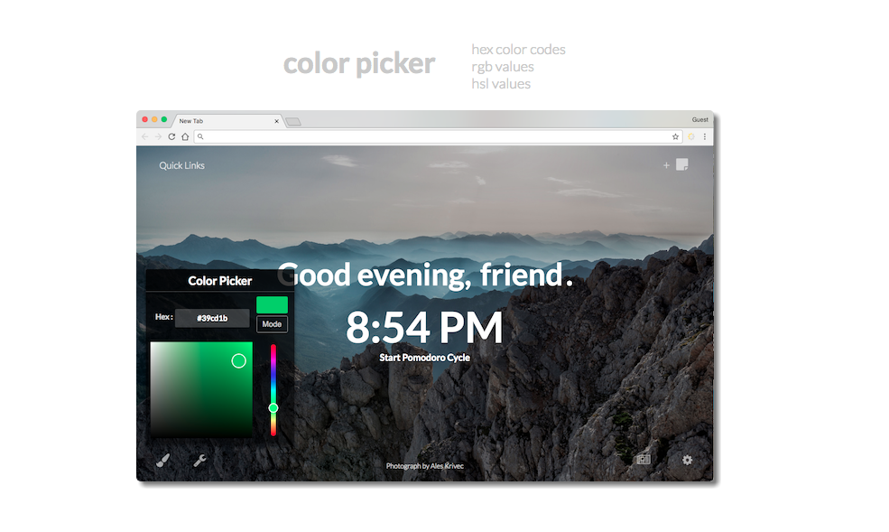

## Table of Contents
* [About](#about)
* [Download](#download)
* [Features](#features)
* [Contributing](#contributing)
* [Installation](#deployment-to-chrome)
* [Build Tools](#built-with)
* [Releases](#releases)
* [Contributors](#contributors)

## About
DevTab is a front-end developer focused new tab extension for your web browser (currently available for Google Chrome and Mozilla Firefox). This new homepage is designed to help cater to a developer's everyday needs including quicklinks, a color picker, code validators, sticky note reminders, and more. It is created by a  [team](#contributors) of passionate coders in collaboration with [chingu cohorts](https://chingu-cohorts.github.io/chingu-directory/), an international community of remote developers.

## Download
* [Google Chrome Store](https://chrome.google.com/webstore/detail/devtab/alolnmpdpmfhpcaljhaheeoedkfkganm)
* [Mozilla Firefox Add-Ons](https://addons.mozilla.org/en-US/firefox/addon/devtab/)

## Features
* Pomodoro timer to keep you productive and focused
* Quicklinks to quickly access your most used websites
* Sticky notes to store information, tasks, reminders, etc.
* Color picker to quickly access hex, RGB, and HSL codes
* HTML/CSS validators to ensure your code is up to standards with W3C
* Page speed insights to see how to optimize your code
* Newsfeed to stay informed on the latest news
* Settings to customize your homepage to your liking

## Contributing
[Instructions](https://github.com/chingu-coders/Voyage2-Turtles-02/blob/master/CONTRIBUTING.md)

## Deployment to Google Chrome
1. Clone or download this repo
2. Open up Google Chrome
3. Enter `chrome://extensions` in browser's address bar
4. In top right-hand corner, ensure that the **Developer Mode** box is checked
5. Click **Load unpacked extension...** ; a file navigation box will appear
6. Navigate to the directory where you cloned/downloaded the repo, select the `dist` folder and click **Select**
7. DevTab extension should appear on page
8. On right-hand side, ensure the **Enabled** box is checked
9. Open up a new tab either by pressing the new tab button on the top-right hand corner of your browser or by pressing `Cmd+T` (mac) or `Ctrl+T` (windows)

## Deployment to Mozilla Firefox (for testing)
1. Clone or download this repo
2. Open up Mozilla Firefox
3. Either enter `about:debugging` in browser's address bar and on the top, click on **Load Temporary Add-On**
4. Navigate to the directory where you cloned/downloaded the repo, select the `dist` folder, and then select the `manifest.json` or `index.html` file and click **Open**
5. DevTab extension should appear on page
6. Open up a new tab either by pressing the new tab button on the top-right hand corner of your browser or by pressing `Cmd+T` (mac) or `Ctrl+T` (windows)
7. This will remain as the temporary extension until Firefox is closed or restarted

## Built With

* HTML5
* CSS3
* JavaScript
* jQuery/jQuery UI
* [tinycolor.js](https://github.com/bgrins/TinyColor)

## Releases
* **v1.1.2**
  * *Vertical overflow fixed*
  * *Sticky notes are re-sizable*
  * *Added version releases to settings menu*
* **v1.1.1**
  * *Quicklinks flicker bug fixed*
  * *Hidden overflow injection on mozilla pages bug fixed*
* **v1.1.0**
  * *Extension ported to Mozilla Firefox*
* **v1.0.0**
  * *Initial deployment to Google Chrome*

## Contributors

* [Jeff Bothe](https://github.com/jmbothe)
* [Tyler Del Rosario](https://github.com/TylerDelRosario)
* [Dan Nguyen](https://github.com/ziggysauce)
